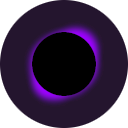

# Gravity Fusion

_A colorful incremental game_

## Links

 

## About

Welcome to Gravity Fusion, the best physics simulator in the galaxy!  
Well... Maybe not the best in the Milky Way, but the best in _your_ galaxy!

In Gravity Fusion you'll create your own galaxy, starting from the Black Hole at the center and then slowly adding Particles around it!

All Particles are affected by the [Law of Universal Gravitation](https://en.wikipedia.org/wiki/Newton's_law_of_universal_gravitation), and so they attract each other, and are attracted towards the Black Hole. 

If 6 Particles of the same quality touch, they merge into a heavier, higher quality Particle, that may autonomously produce smaller Particles. 

Be careful: the Black Hole can eat your particles, gaining more Mass!  

However, if you let your Black Hole grow, you may be able to buy some upgrades from a friendly alien...

## Controls

- **LMB** (Left mouse button) - Spawn a Particle
- **MMB** (Middle mouse button) / **Space** - Pan camera
- **Scroll wheel** - Zoom camera
- **RMB** (Right mouse button) - (Requires upgrade) Use the Anti-G Field
- **R** - Center the camera on the black hole
- **Tab** / **Escape** - Upgrade menu
- **Alt**+**F4** - Quit game

## Screenshots

